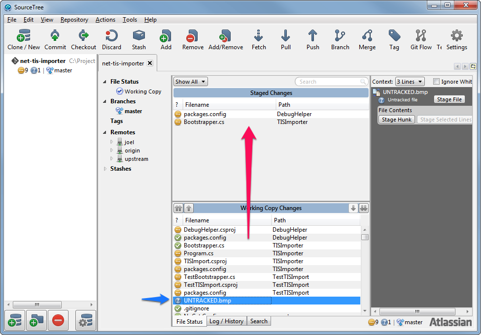
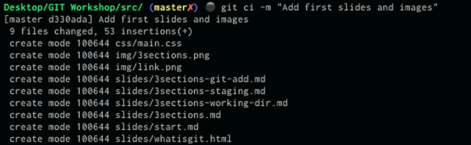

#Git - What, Why and How?

##What is git?

"What exactly is this git thing?!", you ask.

Well, git is a *distributed version control system*.
What does this mean, really? It means that:

- *Version control system*
  Git allows you to track changes to your work, keeping previous versions in
  history, and allowing you to revert back to them if something goes wrong (and
          eventually, something usually does).
  You may know other version control systems like SVN and Mercurial. Git does
  the same (and more), but sometimes in different (often better) ways.
- [*Distributed*](http://git-scm.com/book/en/Getting-Started-About-Version-Control#Distributed-Version-Control-Systems)
  Unlike SVN, for instance, git is a *distributed* version control system. That
  means that there is no single central repository as the only point of
  access. In git, everyone working in a project has a complete, working
  repository, and can connect to other repositories to share work (we will talk
          about this later on).
- *Local operations*
  As said above, everyone working in a project in git has their own repository.
  This repository is local to the developer's computer, which means that, for
  most of the operations, you don't need access to a server, or even an internet
  connection. You can work in an airplane, in a tropical beach, you name it.
  This also means that, by not going to the server every time, git is also
  faster. It may not seem much, but after a while this can save you a lot of
  time.

##Why ~is git~ should I use git?

"OK, so I know what this git thing is... But why should I use it?", you ask
again, clearly not satisfied.

So, if the previous items didn't convince you, let me list them, and others, as
a set of advantages:

- With git you can track changes to your work and revert when something goes
wrong
  An advantage versus having no version control at all.
- You can work offline without a hitch.
  Try working in SVN without access to the server
- There are effectively multiple backups of the code
  Since everyone has a repository, each person has a complete copy of the whole
   history of the code.
- It is faster
  You don't have to wait for anyone else for (almost) anything. And the program
   itself was built thinking of speed.
- It's easier to collaborate
  Since everyone has a repository, anyone can work in any part of the code
   without getting on someone else's toes. You can also get someone else's code
   without having to go through the central repository first. This can be useful
   for reviewing.
- No more branch/merge fear
  Compared to previous version control systems, git allows for *much* easier
   branching and merging. We'll see this later, but for now let's just say that
   the ability to switch between branches whenever you'd like and merge them
  (nearly) without any problems is *really* nice.
- More agile workflows
  The ability to branch and merge easily allows for some interesting and very
   helpful workflows (which, again, we'll talk about later).
- Used everywhere
  If nothing else convinces you, just know that *a lot* of projects use it. From
   very small ones (e.g. a lot of stuff that's on github) to big ones (e.g. the
   Linux kernel). So, it's not some newfangled curiosity that's going
   away in a few months. It's here to stay.

For some more material, check
[this](http://www.git-tower.com/blog/8-reasons-for-switching-to-git/) out.

Convinced now?
Then, let's take a look at how git works and how you should work with it.

##How do I work with it?!

First, the basics:

##Clients

To work with git, you need to have a client.
If you're more of a ~geek~ technical-minded person, you can use the command
line (with a fairly detailed tutorial
        [here](http://guides.beanstalkapp.com/version-control/git-on-windows.html)),
or a GUI like
[SourceTree](https://sites.google.com/a/coolblue.nl/it-wiki/algemeen/version-control/github/sourcetree-git-gui).
(But please don't use TortoiseGit. It really doesn't help when you want to use
 git the right way)

###3 Sections

Git divides your workspace into 3 sections:

- Working directory (also called working copy)
  This is what you work on. The working directory includes any new files
  created, new changes to existing files, etc. When you look at your project
  folder you see your working directory.
- Staging area (also sometimes called index)
  The staging area is where changes (editing, adding or removing files) are
  placed in preparation to be sent to the repository. When you `commit` (see
  below), only changes in the staging area are sent.
- Repository (local to your computer)
  When changes are sent to the repository (committed), they are now effectively
  under version control. Once here, you can later recover previous changes,
  check any file's history, etc. When your work gets here, it's safe.

####Basic workflow

Here's how you can work, in the most basic way, with git:

1. Get a repository
   Of course, you'll always need to have a repository. If you're using the
   command line, you can actually create it anew with `git init` (in the project
   folder). SourceTree doesn't allow this, for some reason. But you can also
   *clone* another repository and start from there.
2. Work
   This is the easy part. Just do your thing. Create, delete, and edit files.
   Make your colleagues proud.
3. Add files to the staging area
   In the command line you do `git add <files>`. You can actually do a lot of
   neat tricks here (e.g. add certain lines and not others), but for now just
   stick to this. In SourceTree you drag the files you want to add to the
   staging area, like this:
   
   You can also see (pointed out in blue) untracked files. Until you
   specifically add them, git does not track these files and just leaves them
   alone. Here's how it looks in the command line:
   
   Now you're ready to...
4. Commit your changes
   Here is when you actually send your changes to the repository. After this,
   they're safe.
   In the command line, you use the `git commit` command.
   
   In SourceTree, just press the `Commit` button.
   
   In SourceTree you can still change the staging area and configure your commit
   at this point, but is the same as if you did it earlier.
   In both clients you must write a commit message. Unlike other version control
   systems, git forces you to write one. Try to write [good commit
   messages](http://tbaggery.com/2008/04/19/a-note-about-git-commit-messages.html).
   They may not look too important, but they *really* help when something goes
   wrong and you have to find out where.

####Commits

Changes are stored in the repository under sequential commit objects. Each
commit is uniquely identified by a hash value. You can see them in the command
line using `git log`:

Or, in SourceTree, by just clicking on a branch.

(You can also have fancy graphs in the command line, but it does take a little
 more work).

####Checkout

Sometimes you just need to travel back in time. It's a fact of (developer) life.
In git that's done by *checking out* a commit (you usually do this with branches
rather than directly to commits, but we'll see that later).
In the command line, you do `git checkout 4035e4`. As you can see, you can use
an abbreviation for a commit instead (as long as it isn't ambiguous).
In SourceTree, you press the `Checkout` button and select a commit.
Either way, this will replace the contents of your working copy with the
how it was at the time of the selected commit.

####Stashing

It may happen that you have made some changes and suddenly you need to do
something else (fix a bug in a previous version, merge branches, etc.), but your
changes are not ready to be committed yet. This is when you stash them. Stashing
takes the current state of your working directory and saves it in a stack of
unfinished changes, which can be reapplied when you need them again (or
just dropped).
To stash your changes, do this:
In the command line: `git stash`.
Or, if you want to specify a message to make it easier to remember:
`git stash save "my message"`.
In SourceTree, just press the `Stash` button, and it will ask you for a descriptive
message:

This will clear your unfinished changes and leave you free to work on whatever
you need.
Once you are done and want to go back to the changes, just use, in the command
line:
`git stash pop` (this will apply the latest stash in the stack and remove it),
Or in SourceTree, right-click the stash you want (under *Stashes*), and select
`Apply...`:

If you want the stash to be deleted after applying (and you normally do) you
should select `Delete after applying` in the confirmation window that comes up
then (or just delete it manually after applying).

Next up, [branching](GIT BRANCHING ARTICLE)!
