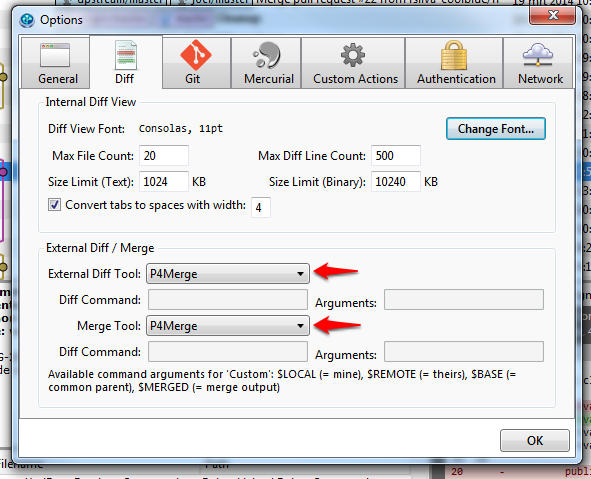

#Git - branching

If you're working alone in your own project, just doing one thing (or a very
linear set of things), then the basic workflow we saw works fine.
However, when you want to collaborate with others (and not interfere in their
work), or work on new features while keeping old stable versions readily
available (e.g. for bug fixing), then you need branches (even if you think you
don't).

You may remember from older version control systems like CVS and SVN that
branches were these heavy things that created more problems than they solved,
and merging was a nightmare. Well, not any more.

In git, merging is not only very easy, it is actually encouraged, and pretty
much part of every decent workflow you find.

##Branches in git

Git uses "lightweight" branches. This means that they are simply a pointer to a
commit. Nothing is copied when you create a branch, git just creates a new
pointer and makes it point to the latest commit, and that's it. You may not see
the advantage of this, but let's just say that it's what allows git to
be so good at branching and merging.

In git you are always working in a branch. This is called the current branch,
and the default (created along with the repository) is `master`.


##What is HEAD?

You probably already noticed, sometimes, a reference to something called HEAD.
You probably wondered "what the heck is this?!". 

HEAD is the commit you are currently in. It is basically a pointer that marks
your current location. It usually points to a branch (e.g. `master`), meaning
that you are currently at the tip (the latest commit) of that branch. Think of
HEAD as a "You are here" marker, because that is exactly what it is.

Check out [this
post](http://www.gitguys.com/topics/head-where-are-we-where-were-we/) for some more information.

##How to do it

Ok, let's go for a visual step-by-step tour around git branches.
We start with a normal repository with just a few commits, like this:


###Create a branch

In the command line, to create a new branch and immediately switch to it, you run `git checkout -b <branch_name>`.
If, for some reason, you want to simply create a new branch but remain in the
current one, you can use `git branch <branch_name>`.

In SourceTree, just press the `Branch` button:

The `Checkout New Branch` checkbox is checked by default. Uncheck it if you do
not want to switch to the new branch after its creation.

So, let's say we created a branch named `first_branch`. This is what we get:


###Switch to (checkout) a branch

As said before, branches in git are simply pointers to commits. And, as we saw
in [the previous
article](https://sites.google.com/a/coolblue.nl/it-wiki/algemeen/version-control/git-an-introduction/1-git-basics#TOC-Checkout),
you can (in the command line) checkout a commit by running `git checkout`. So,
in the command line, you can checkout a branch by doing `git checkout branch_name`.
In SourceTree, you right-click the branch you want to select and choose the
`Checkout <branch>...` option.


If you have uncommitted changes and try to switch to a branch that points to a
different commit than the one you are in (the one currently checked out), git
won't let you, since you would overwrite the changes you currently have. This is
the point where you either commit your changes if they're good enough for
committing, or
[stash](https://sites.google.com/a/coolblue.nl/it-wiki/algemeen/version-control/git-an-introduction/1-git-basics#TOC-Stashing) them otherwise.

Now we switched to the `first_commit` branch. After some coding, we're ready to
commit:
```bash
git add .
git commit -m "First commit in new branch"
```
This gives us the following:


###Merging branches

After you have committed your work (if it's good), you'll want to eventually put
it back in the `master` branch (or any other, but `master` is the most common
"release" branch).
For that you `merge` one branch (the one you've been working on) into another
(the one you want to go back to).
First you have to checkout the destination branch (in our case, `master`). Then
merge the other branch (here, `first_branch`) into it.
In the command line you do it like this:

In SourceTree you checkout the destination branch, right-click the branch to be
merged, and select `Merge <branch_name> into current branch`:

In this case the `first_branch` branch was simply a few commits ahead of
`master`, so the merge was very simple. This is what's called a *fast-forward*
merge. In this case, git simply advances the `master` branch pointer to the last
commit, and no other changes are necessary.
Our repository now looks like this:

 
Now, let's try a more complicated example. Let's say we did some more commits in
`first_branch`. But then, for some reason (e.g. bug fixes) we also did a
different commit in `master`. This is how it looks:


Here a fast-forward merge is not possible, but git still manages to merge the
branches:


This creates a new commit (git asks you to write a message for it) for the
merge, resulting in:


###Conflicts

Sometimes, especially when multiple people are working in the same thing
simultaneously, incompatible changes are made in two branches. When git tries to
merge these changes this results in a conflict. When conflicts occur, the merge
is not completed, and git waits for the user to solve the conflict.


####Solving conflicts manually

The most basic way in which you can solve conflicts is manually, i.e. edit the
conflicted file directly and solve the conflict there. Conflicting changes are
left in the file, marked with the commit they belong to:


(The top name (HEAD) refers to the branch you are merging *into* (HEAD means the
last commit made in the current branch). The bottom one (first\_branch) refers to
the branch you are merging *from*).

In this case, the steps to solve conflicts are:
* Edit the conflicted files so that they are in the "correct" state. Remove the
  parts you don't want, and fix anything that is wrong.
    * And don't forget to remove git's conflict marker lines as well
* `add` the modified files to the staging area
* `commit` your changes to complete the merge

####Solving conflicts using external tools

Editing the files manually is perfectly fine if the conflicts are small and
easily manageable. But sometimes things really go wrong and you have more
complicated commits. In those cases (or, really, if you just prefer a visual
tool for this) it's better to use a graphical merge tool. These tools show you
the differences between two files (e.g. between the two versions of the file you
are trying to merge) and allow you to choose which one you want graphically.

One of those tools is `p4merge`, and you can find it [here](http://www.perforce.com/downloads/Perforce/20-User#10).
The package includes more tools, but the one we're focusing on is just
`p4merge` (You can de-select the others when installing):


After installing, you can use `p4merge` to solve conflicts or just check
differences (diffs) between separate file versions.
You can do that in two ways (for both of them, p4merge must be in your PATH):

* From the command line:
  To check a file's differences between the current version and another commit:
  * Specifying a file:
  ```bash
  git diftool --tool=p4merge <other_commit> -- <file>
  ```
  * Not specifying a file:
  ```bash
  git diftool --tool=p4merge <other_commit>
  ```

  And for merging conflicts:
  * Specifying a file:
  ```bash
  git mergetool --tool=p4merge <file>
  ```
  * Not specifying a file:
  ```bash
  git mergetool --tool=p4merge
  ```

  In both cases, if you don't specify a file, git will ask you to run the merge
  tool in each of the relevant files (conflicted for `mergetool`, all of them
  for `difftool`).
  For more information, check these links:
  * [Documentation about difftool](http://git-scm.com/docs/git-difftool.html)
  * [Documentation about mergetool](http://git-scm.com/docs/git-mergetool.html)

* In SourceTree:
  First you need to configure SourceTree to use `p4merge` as an external `diff`
  and `merge` tool. You do this by going to the `Tools` menu, selecting
  `Options`, and then `Diff`:

  

  There you just have to set `p4merge` as the external `diff` and `merge` tool,
  as in the image.

  Then, when to use it:
  * For differences:
    Right-click a file you want to diff (in a different commit) and select
    `External Diff`:

    

  * For conflicts:
    Right-click a conflicted file and select `External merge`:

    

For file differences, this is the appearance of `p4merge`'s window:


For merging conflicts, it shows this one:


For selecting the changes you want to keep you can either:
* Choose to use one version completely (click the corresponding symbol,
  from the ones pointed in red in the picture), or
* Choose the individual chunk you want to use for each conflict (click one of 
  the symbols pointed in blue in the picture)

After choosing the right changes, just save the file and exit p4merge. The
conflict will be solved, and you just have to `add` and `commit` the files to
finish the merge.

Check this link for [more info about merging with p4merge](http://www.perforce.com/perforce/doc.current/manuals/p4v/merging_files.html)


###Deleting branches

In the end, when everything is done and merged, and you don't need the other
branch anymore, you can (and usually should) delete it.
In the command line, you do this:
```bash
git branch -d first_branch
```

In SourceTree, you right-click a branch and choose `Delete <branch>`:


In the end, this is how our repository looks:


###Branching workflow

As we seen, branching in git is pretty easy, and usually simple. That's why,
contrary to most previous version control systems, in git branching is heavily
used, and made its way to a lot of developers' daily workflow. There are some
more complex workflows, such as
[gitflow](http://nvie.com/posts/a-successful-git-branching-model/), but the
simplest one follows these guidelines:
* The `master` branch is for "complete" code. Compilable, running, correct (as
much as possible) code.
* Whenever you need to change something or do something new, create a new
branch (it's called a _feature branch_, since it is created for a new feature),
give it a suggestive name (e.g. `new_feature`), and check it out.
* Do the new work only in the new branch. If you need to fix something in
previous work, switch back to `master` and fix it (ideally create a branch for
the fix as well).
* When you're done with the new work (everything must be working and committed), merge the
new branch back into `master`.
* Now that all the new changes are back in `master`, you can delete the feature
branch and start the process all over again.
