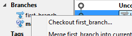

#Git - branching

If you're working alone in your own project, just doing one thing (or a very
linear set of things), then the basic workflow we saw works fine.
However, when you want to collaborate with others (and not interfere in their
work), or work on new features while keeping old stable versions readily
available (e.g. for bug fixing), then you need branches (even if you think you
don't).

You may remember from older version control systems like CVS and SVN that
branches were these heavy things that created more problems than they solved,
and merging was a nightmare. Well, not any more.

In git, merging is not only very easy, it is actually encouraged, and pretty
much part of every decent workflow you find.

##Branches in git

Git uses "lightweight" branches. This means that they are simply a pointer to a
commit. Nothing is copied when you create a branch, git just creates a new
pointer and makes it point to the latest commit, and that's it. You may not see
the advantage of this, but let's just say that it's what allows git to
be so good at branching and merging.

In git you are always working in a branch. This is called the current branch,
and the default (created along with the repository) is `master`.


##How to do it

Ok, let's go for a visual step-by-step tour around git branches.
We start with a normal repository with just a few commits, like this:


###Create a branch

In the command line, to create a new branch and immediately switch to it, you run `git checkout -b <branch_name>`.
If, for some reason, you want to simply create a new branch but remain in the
current one, you can use `git branch <branch_name>`.

In SourceTree, just press the `Branch` button:

The `Checkout New Branch` checkbox is checked by default. Uncheck it if you do
not want to switch to the new branch after its creation.

So, let's say we created a branch named `first_branch`. This is what we get:


###Switch to (checkout) a branch

As said before, branches in git are simply pointers to commits. And, as we saw
in [the previous
article](https://sites.google.com/a/coolblue.nl/it-wiki/algemeen/version-control/git-an-introduction/1-git-basics#TOC-Checkout),
you can (in the command line) checkout a commit by running `git checkout`. So,
in the command line, you can checkout a branch by doing `git checkout branch_name`.
In SourceTree, you right-click the branch you want to select and choose the
`Checkout <branch>...` option.


If you have uncommitted changes and try to switch to a branch that points to a
different commit than the one you are in (the one currently checked out), git
won't let you, since you would overwrite the changes you currently have. This is
the point where you either commit your changes if they're good enough for
committing, or
[stash](https://sites.google.com/a/coolblue.nl/it-wiki/algemeen/version-control/git-an-introduction/1-git-basics#TOC-Stashing) them otherwise.

Now we switched to the `first_commit` branch. After some coding, we're ready to
commit:
```bash
git add .
git commit -m "First commit in new branch"
```
This gives us the following:


###Merging branches

After you have committed your work (if it's good), you'll want to eventually put
it back in the `master` branch (or any other, but `master` is the most common
"release" branch).
For that you `merge` one branch (the one you've been working on) into another
(the one you want to go back to).
First you have to checkout the destination branch (in our case, `master`). Then
merge the other branch (here, `first_branch`) into it.
In the command line you do it like this:

In SourceTree you checkout the destination branch, right-click the branch to be
merged, and select `Merge <branch_name> into current branch`:

In this case the `first_branch` branch was simply a few commits ahead of
`master`, so the merge was very simple. This is what's called a *fast-forward*
merge. In this case, git simply advances the `master` branch pointer to the last
commit, and no other changes are necessary.
Our repository now looks like this:

 
Now, let's try a more complicated example. Let's say we did some more commits in
`first_branch`. But then, for some reason (e.g. bug fixes) we also did a
different commit in `master`. This is how it looks:


Here a fast-forward merge is not possible, but git still manages to merge the
branches:


This creates a new commit (git asks you to write a message for it) for the
merge, resulting in:


Here are some conflicting changes.

These lines will be conflicted because they were inserted in the same place as
others were, but in a different branch.

This serves to illustrate an external merge.
